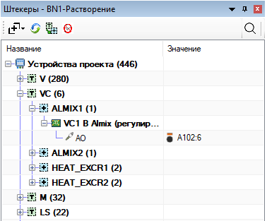
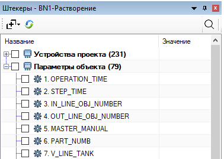
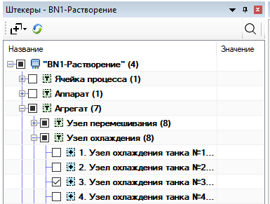
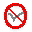

# Окно «Привязка» #

Окно объединяет привязку каналов устройств к клеммам модулей I/O
и графическое заполнение полей редактора технологических объектов
(устройства, параметры, ограничения, привязанные агрегаты).

Вызов: меню **EPlaner → Привязка**. Окно встраивается в панель EPLAN.

2 основных режима работы:

| Режим | Когда | Дерево |
| --- | --- | --- |
| **Сигналы** | редактор объектов закрыт или не в режиме редактирования | устройства и каналы |
| **Объекты** | в редакторе включен режим редактирования и выбрана подходящая строка | дерево с данными для заполнения выбранной строки |

## Содержание ##

+ [Панель инструментов](#1-панель-инструментов)
+ [Привязка каналов к модулям IO](#2-привязка-каналов-к-модулям-io)
+ [Помощник привязки редактора технологических объектов](#3-помощник-привязки-редактора-технологических-объектов)
+ [Контекстное меню и переход на ФСА](#4-контекстное-меню-и-переход-на-фса)

### 1 Панель инструментов ###

Слева направо:

-  **Развернуть** — уровень развёртки дерева (1–5) или «Свернуть всё».
-  **Обновить** — [синхронизация и сохранение (7.1.9)](ReadMe.md#719-Сохранение-результатов-редактирования) описания из EPLAN; обновляет дерево.
-   **Группировка** — только в режиме сигналов: **Тип → Объект** или **Объект → Тип**.
-  **Без привязки** — только в режиме сигналов; по умолчанию включено. Скрывает уже привязанные каналы и группы без свободных сигналов.
-  **Поиск** — открыть поле поиска (<kbd>Ctrl</kbd> + <kbd>F</kbd>).

### 2 Привязка каналов к модулям IO ###

Режим сигналов — дерево устройств проекта с каналами. Колонка **Значение**
у канала показывает клемму (например, `A102:6`), если канал привязан.

Устройства без каналов (например, виртуальные `DO_VIRT`) в дерево не попадают.

1. Выберите клемму на ФСА или в окне [структуры ПЛК](StructPLC.md).
2. Дважды щёлкните канал в окне **Привязка**.
3. Повторный двойной щелчок по тому же каналу без <kbd>Ctrl</kbd> снимает привязку.

<kbd>Ctrl</kbd> — множественная привязка к одной клемме.

При включённом **Без привязки** после привязки канал сразу скрывается;
после отвязки снова появляется в списке.

Подробные правила и ограничения — [раздел 4.2](ReadMe.md#42-Привязка-устройств-к-модулям-IO). Привязка каналов также доступна в окне [«Устройства»](DevicesView.md).

### 3 Помощник привязки редактора технологических объектов ###

Включите режим редактирования в [редакторе технологических объектов](ReadMe.md#717-Добавление-устройств-в-операции-в-графическом-виде) и выберите строку. Окно **Привязка** показывает дерево с выбором данных. Изменения сразу записываются в выбранное поле редактора.

Если для выбранной строки графическая привязка не предусмотрена, дерево пустое (**Привязка**).

Группировка и фильтр **Без привязки** в этом режиме скрыты. Дерево устройств всегда **Объект → Тип**. Группы с тем же ОУ, что у редактируемого объекта, и группы с уже отмеченными устройствами отображаются вверху списка.

Галочка на видимом родителе отмечает и скрытые фильтром (при поиске) дочерние узлы.

Подробнее: [табличный режим (7.1.8)](ReadMe.md#718-Добавление-устройств-в-операции-в-табличном-режиме), [привязка объектов (7.3.1)](ReadMe.md#731-Привязка-базовых-объектов-друг-к-другу), [ограничения](ReadMe.md#8-Установка-ограничений).

### 4 Контекстное меню и переход на ФСА ###

**Перейти на ФСА** (ПКМ, колесо мыши или <kbd>Ctrl</kbd> + <kbd>ЛКМ</kbd>) — открыть страницу устройства или привязанной клеммы на схеме.
