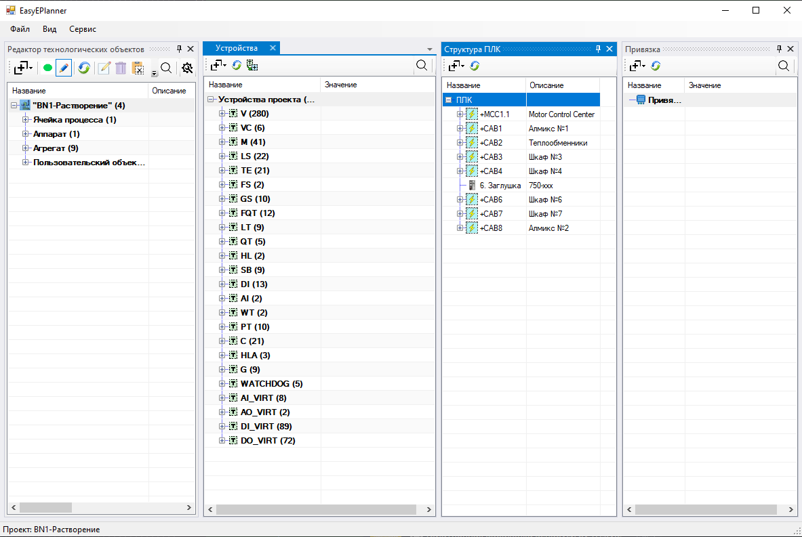

# EasyEPlanner.App — автономное приложение #

`EasyEPlanner.App` — отдельное Windows-приложение, позволяющее открывать,
просматривать и редактировать описание проекта (технологические объекты,
устройства, структура ПЛК, привязка, Modbus-обмен) **без запущенного EPLAN**.

Приложение работает с той же папкой проекта и теми же Lua-файлами
(`main.objects.lua`, `main.io.lua` и др.), что и надстройка EasyEPlanner
внутри EPLAN, поэтому изменения, сделанные в приложении, корректно
открываются потом в EPLAN, и наоборот.




## 1 Расположение и запуск ##

Исполняемый файл `EasyEPlanner.App.exe` собирается в **одну папку с
библиотекой надстройки** (`EPLAN.EplAddin.EasyEPlanner*.dll`). Там же
лежит общий файл `configuration.ini`: приложение и надстройка используют
**один и тот же** файл конфигурации, поэтому настройка каталога проектов
(см. [п. 3](#3-настройка-каталога-проектов)) делается один раз и
действует в обоих режимах.

Для запуска достаточно открыть `EasyEPlanner.App.exe` из этой папки —
установка не требуется.


## 2 Главное окно ##

Главное окно содержит меню **Файл**, **Вид**, **Сервис** и строку
состояния внизу.

### 2.1 Меню «Файл» ###

+ **Открыть папку проекта...** — открывает диалог выбора папки с
  Lua-файлами проекта (там, где лежит `main.objects.lua`) и загружает
  проект.
+ **Сохранить** — сохраняет технологические объекты, ограничения и
  описание устройств (`main.io.lua`) в папку текущего проекта. Пункт
  доступен только когда проект открыт.
+ **Выход** — закрывает приложение.

### 2.2 Меню «Вид» ###

+ **Редактор технологических объектов** — открывает окно редактирования
  технологических объектов (то же окно, что используется в надстройке
  EPLAN).
+ **Устройства** — окно [«Устройства»](DevicesView.md).
+ **Структура ПЛК** — окно [«Структура ПЛК»](StructPLC.md).
+ **Привязка** — окно [«Привязка»](BindingView.md).

Каждый пункт при первом вызове требует, чтобы был открыт проект — иначе
будет показано соответствующее сообщение.

### 2.3 Меню «Сервис» ###

+ **Modbus-обмен** — окно настройки [Modbus-обмена](ModbusExchange.md).
+ **Обмен сигналами между проектами** — окно
  [межпроектного обмена сигналами](InterprojectExchange.md). Для работы
  с проектами, отличными от текущего открытого, требуется настроенный
  каталог проектов (см. [п. 3](#3-настройка-каталога-проектов)).

### 2.4 Строка состояния ###

Во время открытия проекта строка состояния снизу окна показывает текущий
этап загрузки (загрузка `main.io.lua`, загрузка технологических объектов
и т.д.), а курсор мыши меняется на «часы». После завершения загрузки в
строке состояния отображается имя открытого проекта либо сообщения об
ошибках, обнаруженных при чтении описания.


## 3 Настройка каталога проектов ##

Каталог, где хранятся папки со всеми проектами (используется для
диалога «Открыть папку проекта...» и для поиска других проектов при
[обмене сигналами между проектами](InterprojectExchange.md)), задаётся
в общем файле `configuration.ini` рядом с `EasyEPlanner.App.exe`
(секция `[path]`, ключ `folder_path`; несколько путей разделяются `;`):

```ini
[path]
folder_path=C:\Projects;D:\OldProjects
```

Если файл ещё не существует, он создаётся автоматически при первом
обращении к каталогу проектов (например, в надстройке EPLAN), но со
пустым значением `folder_path` — его нужно заполнить вручную.

При открытии проекта через **Файл → Открыть папку проекта...** диалог
сразу открывается в первом существующем каталоге из `folder_path`, если
он настроен.


## 4 Открытие и сохранение проекта ##

При открытии папки проекта приложение последовательно:

1. Очищает текущие данные об устройствах и модулях ввода-вывода;
2. Загружает `main.io.lua` (устройства, структура ПЛК) — если файл
   найден в выбранной папке;
3. Загружает технологические объекты (`main.objects.lua` и связанные
   файлы);
4. Обновляет окна «Структура ПЛК», «Устройства», «Привязка» (если они
   были открыты ранее) и открывает окно редактора технологических
   объектов.

Если при загрузке возникли предупреждения или ошибки, они отображаются
в строке состояния рядом с именем проекта.

Для сохранения используется **Файл → Сохранить**, либо кнопка
**«Синхронизация и сохранение»** на панели инструментов окон «Устройства»,
«Структура ПЛК» и «Привязка» — в приложении она сохраняет технологические
объекты и `main.io.lua` в папку проекта (в отличие от надстройки EPLAN,
где эта же кнопка ещё и синхронизирует данные с открытым проектом EPLAN).


## 5 Отличия от работы внутри EPLAN ##

Приложение работает с тем же описанием проекта, что и надстройка, но
без запущенного EPLAN часть функций, требующих напрямую обращаться к
проекту ФСА, недоступна:

+ **Переход на ФСА** (пункт контекстного меню, переход по <kbd>Ctrl</kbd> +
  <kbd>ЛКМ</kbd>/колесику мыши) — недоступен, так как нет открытого
  проекта EPLAN, на который можно перейти.
+ **Сдвиг модулей**, **Восстановление удалённых модулей**, **Удаление
  модулей** в окне «Структура ПЛК» — операции, требующие переименования
  клемм на ФСА, недоступны без EPLAN; изменения в структуре ПЛК,
  требующие переименования, следует выполнять в EPLAN.
+ Привязка каналов устройств к клеммам (двойной клик/<kbd>Delete</kbd>
  в окне «Структура ПЛК») по-прежнему работает — она меняет только
  Lua-описание проекта.

Во всём остальном (редактирование технологических объектов, устройств,
Modbus-обмен, обмен сигналами между проектами) приложение работает
так же, как надстройка EPLAN — см. соответствующие разделы
[основной документации](ReadMe.md).
